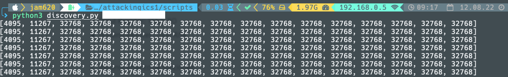

# Attacking ICS

Recientemente recordando una conversación con los colegas de Toadsec surgió un tema  pendiente y era sobre investigar un poco sobre los ataques a Sistemas de Control Industrial (Industrial Control System - ICS), que mejor manera que desarrollar el room de [TryHackeme](https://tryhackme.com/room/attackingics1) introductorio, donde explica debido a la naturaleza de estas tecnologías operacionales y de control industrial los software son diseñados para ser rápidos y funcionales, pero **no seguros**. Esto implica que los mismos son vulnerables y se pueden aplicar las fases de cyber kill chain para realizar ataques a lo sistemas ICS.

A finales del año 2015, SANS Institute publicó un informe adaptando CyberKillChain a los sistemas de control. Este informe amplía las etapas originales de Intrusion CyberKillChain (y las divide en dos fases distintas) para adaptarlas mejor a las características de la industria.


Fase 1 Fuente: https://www.incibe-cert.es/en/blog/cyber-kill-chain-applied-ics


Fase2  Fuente: https://www.incibe-cert.es/en/blog/cyber-kill-chain-applied-ics

Antes de iniciar en la parte práctica es importante entender algunas definiciones.

Los sistemas de Supervisión, Control y Adquisición de Datos (SCADA) se utilizan para controlar y automatizar procesos industriales. Los sistemas SCADA incluyen:

* **Computadoras de supervisión:** los servidores utilizados para administrar el proceso recopilando datos sobre el proceso y comunicándose con los dispositivos archivados (PLC/RTU). En implementaciones más pequeñas, la HMI está integrada en una sola computadora, en implementaciones más grandes, la HMI está instalada en una computadora dedicada.

* **Controladores lógicos programables (PLC):** computadoras digitales utilizadas principalmente para la automatización de procesos industriales. Se utilizan para monitorear continuamente sensores (entrada) y tomar decisiones controlando dispositivos (salida).

* **Unidades Terminales Remotas (RTU):** hoy en día las funcionalidades de las RTU y los PLC se superponen entre sí. Por lo general, se prefieren las RTU para una telemetría geográfica más amplia, mientras que los PLC son mejores con controles locales.

* **Red de comunicación:** la red que conecta todos los componentes SCADA (Ethernet, Serial, teléfonos, radio, celular...). Las fallas en la red no necesariamente tienen un impacto negativo en el proceso de la planta. Tanto las RTU como los PLC deben diseñarse para operar de manera autónoma, utilizando la última instrucción dada por el sistema de supervisión.

* **Interfaz hombre-máquina (HMI):** muestra una representación digitalizada de la planta. Los operadores pueden interactuar con la planta emitiendo comandos usando mouse, teclados o pantallas táctiles. Los operadores pueden tomar decisiones de supervisión ajustando o anulando el comportamiento normal de la planta.

En este articulo solamente cubriremos la fase de reconocimiento para evitar que sea demasiado largo, en posteriores artículos cubriremos las demás fases del Cyberkillchain ICS

1. ##### Reconocimiento pasivo Shodan

   Basta contar con una cuenta educativa o pagada en shodan para comenzar a realizar búsquedas de diversos sistemas de control industrial y SCADA

   Haciendo búsqueda por protocolo Modbus

   

   

   Haciendo búsqueda de HMI

   


Búsquedas de Siemens S7-1200 PLC


Un resumen corto de algunos protocoles de comunicación y sus puertos más utilizados en SCADA e ICS


Fuente: https://www.linkedin.com/pulse/how-search-icsscada-systems-using-shodan-muhammad-mesbah/

Alguno de los resultados que podemos encontrar en Panamá


Podemos observar que algunos tienen como resultado interfaz web de UPS


Nos enfocaremos en Modbus, Modbus es un protocolo industrial desarrollado por Modicon, adquirido por Schneider Electric. Modbus se usa ampliamente para conectar dispositivos industriales; la especificación del protocolo está disponible y libre de regalías.


Observamos algunas empresas con ICS conectados a internet, principalmente el modelo PM5560 de Schneider


Medidores de energia


2. ##### Reconocimiento activo Banner Grabbing

   El banner grabbing nos permite obtener información sobre la infraestructura en este caso en particular información sobre ICS

   Vamos a utilizar el  repositorio de [industrialarmy](https://github.com/industrialarmy/hello_proto) 

   clonamos el repositorio

   ```shell
   git clone https://github.com/industrialarmy/hello_proto
   ```

   Procedemos a entrar al repo y dentro del directorio modbus encontraremos el script a utilizar

   

   `python banner-grabbing.py targetip` 

   

   Si probamos con otro de los targets anteriores

   


Los datos Modbus se utilizan para leer y escribir "registers" que tienen una longitud de 16 bits. El registro más común se denomina "holding register", que es legible y escribible; el tipo de registro "input register" solo es legible. Los registros "coils" y "discrete input" tienen una longitud de 1 bit: las coils se pueden leer y escribir, las discrete input solo se pueden leer.

Es importante conocer algunos de los Tipos de registro Modbus:

- Discrete Input (Status Input): 1bit, RO
- Coil (Discrete Output): 1bit, R/W
- Input Register: 16bit, RO
- Holding Register: 16bit R/W

El siguiente script nos permite observar los registros, proporcionado en el room de Tryhackme

```python
#!/usr/bin/env python3

import sys
import time
from pymodbus.client.sync import ModbusTcpClient as ModbusClient
from pymodbus.exceptions import ConnectionException

ip = sys.argv[1]
client = ModbusClient(ip, port=502)
client.connect()
while True:
    rr = client.read_holding_registers(1, 16)
    print(rr.registers)
    time.sleep(1)

```




3. ##### Reconocimiento de funciones

Usaremos otra herramienta desarrollada por los colegas de [https://github.com/industrialarmy/recon_modbus_functions](https://www.blogger.com/u/1/#)

`git clone https://github.com/industrialarmy/recon_modbus_functions.git `

Accedemos al repositorio y procedemos a ejecutar el script

```shell
python modbus_functions.py --host <modbus host>
```


Vamos a utilizar el modo avanzado


La herramienta nos permite entender un poco más sobre los valores, si comparamos las imágenes podemos comprobar la longitud, slave ID y Función


4. Ataques

   No pensaba cubrir los ataques pero vamos a demostrar dos una denegación que resultara en un intento fallido, en vista que no es la versión vulnerable y el segundo será information disclosure de la contraseña podemos leer más en el siguiente enlace https://claroty.com/team82/research/vulnerabilities-found-in-schneider-m221-plcs

   Continuamos y procedemos a clonar el repo https://github.com/industrialarmy/ics_exploits

   Dentro del repositorio accedemos a la carpeta schneider usaremos ambos

   

   El CVE-2017-601 causa una denegación de servicio a las versiones 

   

   El resultado como era de esperarse fue fallido

   

   El segundo ataque revela la contraseña de ciertas versiones de Schneider 

   

   **Nota:** Estas pruebas son lo menos intensivas que encontramos por tanto no ponen en riesgo la vida de ninguna persona.

5. ##### Conclusiones

   * En la práctica encontramos alrededor de 99 ICS en Panamá, donde este tipo de tecnología no debe tener conectividad al internet por su delicada naturaleza y falta de seguridad.
   * Las industrias son administradas por sistemas sofisticados y de infraestructura critica como SCADA
   * Una software malicioso puede sobre escribir el comportamiento esperado de plantas como  HMI.
   * Los sistemas Modicon M221 PLC, PM5560 y muchos UPS son utilizados comúnmente en Panamá, un ciberdelincuente puede explotar estas fallas y poner procesos críticos en riesgo.

   Por último compartimos un cuadro con herramientas de seguridad para cada fase de la cadena

   

6. ##### Referencias

* *Industrial Control Systems (ICS) Banner Grabbing : MODBUS/TCP*. (2021, 26 julio). Dreamlab Technologies. https://dreamlab.net/en/blog/scada-ics/post/industrial-control-systems-ics-banner-grabbing-modbustcp/
* *Recognizing Modbus functions*. (2020, 19 octubre). Dreamlab Technologies. https://dreamlab.net/en/blog/scada-ics/post/recognizing-modbus-functions/
* *Cyber Kill Chain applied to ICS*. (2021, 13 abril). INCIBE-CERT. https://www.incibe-cert.es/en/blog/cyber-kill-chain-applied-ics
* Handelman, M. (2021, 10 agosto). *Security BSides Athens 2021 - Workshop: Juan Escobar’s «ICS Intrusion KillChain Explained With Real Simulation»*. Security Boulevard. https://securityboulevard.com/2021/08/security-bsides-athens-2021-workshop-juan-escobars-ics-intrusion-killchain-explained-with-real-simulation/
* Matherly, J. (2013, 3 mayo). *Exposing SCADA Systems With Shodan*. Threatpost. https://threatpost.com/exposing-scada-systems-shodan-110910/74644/
* Musbah, M. G. (2019, 22 febrero). *How To Search For ICS/SCADA Systems using Shodan*. https://www.linkedin.com/pulse/how-search-icsscada-systems-using-shodan-muhammad-mesbah/
* *Another Step Toward Hardening Schneider M221 PLCs Against Attack*. (s. f.). Claroty. https://claroty.com/team82/research/vulnerabilities-found-in-schneider-m221-plcs
* O'Donnell, L. (2018, 4 septiembre). *High-Severity Flaws Patched in Schneider Electric Products*. Threatpost. https://threatpost.com/high-severity-flaws-patched-in-schneider-electric-products/137034/